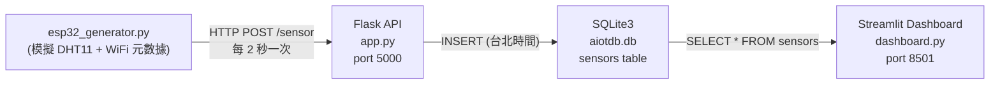

# 📡 0325Aiot - AIoT 智能監控系統專案報告


**專案目錄:** `c:\Users\黃喻琦\Downloads\HW1`
**日期:** 2026-03-25
**技術堆疊:** ESP32 Simulator → Flask (HTTP) → SQLite3 → Streamlit

---

## 🚀 雲端實時演示 (Live Demo)
👉 **[點此查看 Streamlit 雲端動態儀表板](https://0325aiot-hkrg4zclkswrtkvmdp3zg3.streamlit.app/)** 

---

## 🏛️ 系統架構圖 (Architecture Overview)



---

## Step 1 — 檔案建立與說明

在專案目錄下共建立了 4 個核心檔案：

| 檔案 | 用途 |
|---|---|
| `app.py` | Flask REST API — 接收傳感器數據並寫入 SQLite 資料庫 |
| `esp32_generator.py` | ESP32 模擬器 — 每 2 秒發送一次溫濕度數據與 WiFi 狀態 |
| `dashboard.py` | Streamlit 儀表板 — 視覺化顯示 KPI、趨勢圖與歷史數據 |
| `requirements.txt` | Python 依賴套件清單 |

### `app.py` — API 端點說明

| 方法 | 路由 | 描述 |
|---|---|---|
| GET | `/health` | 健康檢查，確認服務是否存活 |
| POST | `/sensor` | 接收 JSON 載荷，轉換時區為台灣時間後存入資料庫 |

### `esp32_generator.py` — 每 2 秒發送的載荷範例

```json
{
  "temp": 24.5,
  "humid": 55.2,
  "metadata": {
    "device": "ESP32_Demo_Unit",
    "wifi_connected": true,
    "wifi_rssi": -65,
    "ip": "192.168.1.100"
  }
}
```

### `dashboard.py` — 儀表板組件
- **3 個 KPI 數據卡**：最新溫度 (°C)、最新濕度 (%)、最後更新時間。
- **即時趨勢圖**：紅色代表溫度紀錄，深藍色代表濕度紀錄。
- **數據表格**：顯示最近 50 筆感測器資料。
- **雲端模擬模式**：若資料庫遺失，會自動生成 Mock 數據以進行 Demo。

---

## Step 2 — 環境與依賴安裝

> **註記:** 為了確保 Streamlit Cloud 部署成功，我們使用了 Python 3.12 穩定的運行環境。

**執行指令:**
```powershell
pip install -r requirements.txt
```

---

## Step 3 — SQLite3 資料庫初始化

Flask 啟動時會自動呼叫 `init_db()` 建立 `aiotdb.db` 與 `sensors` 資料表。

**資料表結構 (Table schema):**
```sql
CREATE TABLE IF NOT EXISTS sensors (
    id        INTEGER PRIMARY KEY AUTOINCREMENT,
    temp      FLOAT,
    humid     FLOAT,
    time      TIMESTAMP,
    metadata  TEXT
);
```

---

## Step 4 — 系統啟動與驗證 ✅

### 1. 啟動 Flask
```powershell
python app.py
```
*   運行於 `http://127.0.0.1:5000`
*   `/health` 驗證：回傳 `{"status": "healthy"}`

### 2. 啟動數據模擬
```powershell
python esp32_generator.py
```
*   日誌確認：每 2 秒出現 `Status: 201`，代表資料成功寫入。

### 3. 啟動視覺化面版
```powershell
streamlit run dashboard.py
```
*   Local URL: `http://localhost:8501`

---

## Final Summary 總結

| 組件 | 狀態 | 連結 / 頻率 |
|---|---|---|
| Flask API | ✅ 運作中 | `http://127.0.0.1:5000` |
| SQLite3 DB | ✅ 已連線 | `aiotdb.db` |
| ESP32 Simulator | ✅ 運作中 | 每 2 秒發送一次 |
| Streamlit Dash | ✅ 運作中 | `http://localhost:8501` |

---

## 重啟指令 (Re-run Commands)

若需重啟所有服務，請開啟三個終端機視窗並執行：

```powershell
# 端點 1 — Flask
.\venv\Scripts\activate
python app.py

# 端點 2 — 模擬器
.\venv\Scripts\activate
python esp32_generator.py

# 端點 3 — 儀表板
.\venv\Scripts\activate
streamlit run dashboard.py
```

---

## 開發筆記 (Notes)

- **時區處理**：所有入庫數據皆已過濾並轉換為 **台灣時間 (Asia/Taipei)**。
- **Demo 安全機制**：本系統包含自動 Mock 模式，即便在雲端執行或資料庫清空時，依然能展示數據動態，適合 Demo 演講使用。

---
*Assisted by Antigravity AI @ Google DeepMind.*
