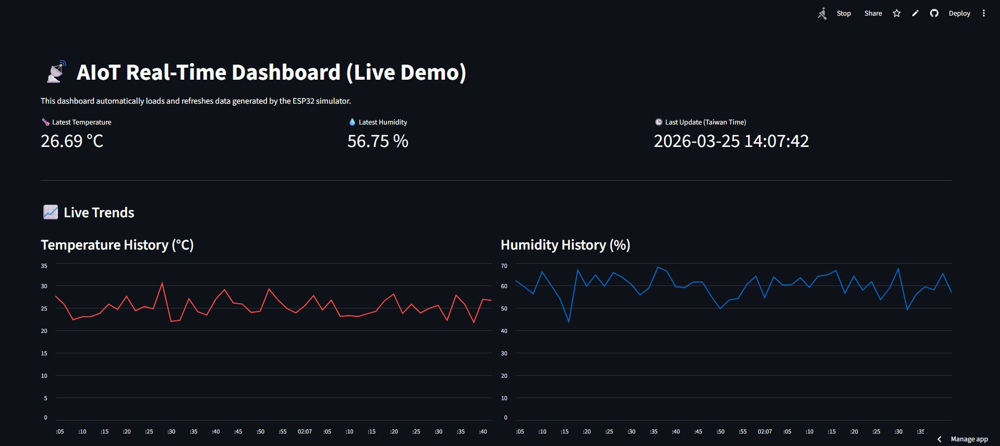

# 0325Aiot - AIoT 本地端測試平台與 Live Demo



### 🚀 [點此查看雲端實時儀表板 (Live Demo)](https://0325aiot-hkrg4zclkswrtkvmdp3zg3.streamlit.app/)

這是一個完整的 Python AIoT 模擬專案，涵蓋感測器資料模擬生成、透過後端 API 接收並儲存在 SQLite，最後在 Streamlit 網頁上呈現即時動態的資料面板。

## 系統架構
1. **ESP32 模擬器 (`esp32_generator.py`)**：負責產生隨機的 DHT11 溫濕度假資料，以及帶著 WiFi 連線資訊的標籤 metadata，每 2 秒透過 HTTP POST 傳送。
2. **Flask 後端與資料庫 (`app.py`)**：提供 `/sensor` API 端點接收感測器傳來的數據，並將 `id`, `temp`, `humid`, `time` (台灣時間) 自動寫入至 SQLite 資料庫 `aiotdb.db` 內的 `sensors` 資料表。提供 `/health` 端點確認服務狀態。
3. **Streamlit 即時儀表板 (`dashboard.py`)**：設計用以做 Live Demo，會不斷從 SQLite 讀取最新數據，在市場端展示最新的溫濕度 KPI、歷史趨勢圖表及詳細數據表格。

## 如何啟動執行

**先決條件**: 電腦已安裝 Python。

### 1. 建立環境與安裝套件
透過終端機在專案根目錄下設定虛擬環境：
```powershell
# 建立並啟動 venv 虛擬環境
python -m venv venv
.\venv\Scripts\activate

# 安裝所需依賴
pip install -r requirements.txt
```

### 2. 依序執行三個程式

請開啟三個不同的終端機，皆切換進入虛擬環境（`.\venv\Scripts\activate`），然後個別執行：

**終端機 1 (執行後端 Flask)**
```powershell
python app.py
```
> 將在 `http://127.0.0.1:5000` 啟動負責接收數據的伺服器。

**終端機 2 (執行硬體模擬器)**
```powershell
python esp32_generator.py
```
> 將會每 2 秒送一筆包含溫濕度及 WiFi 狀態的假造資料到 Flask 伺服器。

**終端機 3 (啟動觀測網頁)**
```powershell
streamlit run dashboard.py
```
> 將會自動打開瀏覽器前往 `http://localhost:8501` 展示 Live Demo！
